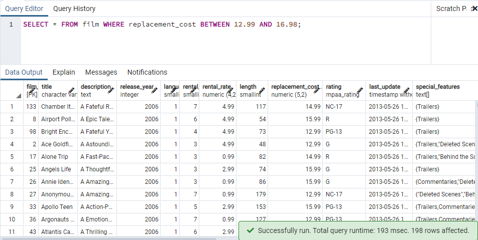
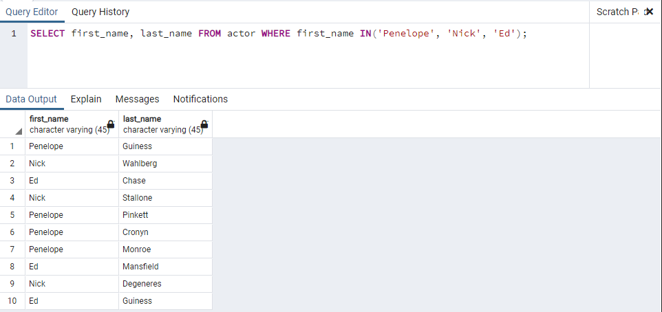

# Kodluyoruz Back-End Java Eğitimi 058

Bu repo [Kodluyoruz](https://www.kodluyoruz.org) Back-End Java Eğitiminde 
oluşturduğum projelerdendir.

---
## SQL Patikası Ödev 2

## Online Film Sistemi

Aşağıdaki sorgu senaryolarını dvdrental örnek veri tabanı üzerinden gerçekleştiriniz.

1) film tablosunda bulunan tüm sütunlardaki verileri replacement cost değeri 12.99 dan büyük eşit ve 16.99 küçük olma koşuluyla sıralayınız ( BETWEEN - AND yapısını kullanınız.)

2) .actor tablosunda bulunan first_name ve last_name sütunlardaki verileri first_name 'Penelope' veya 'Nick' veya 'Ed' değerleri olması koşuluyla sıralayınız. ( IN operatörünü kullanınız.)

3) film tablosunda bulunan tüm sütunlardaki verileri rental_rate 0.99, 2.99, 4.99 VE replacement_cost 12.99, 15.99, 28.99 olma koşullarıyla sıralayınız. ( IN operatörünü kullanınız.) 

---
## License
[MIT](https://choosealicense.com/licenses/mit/)
