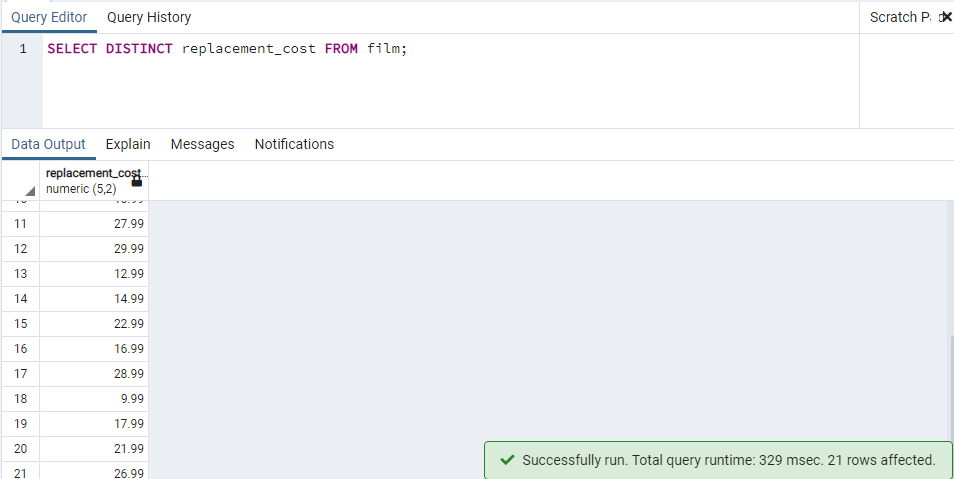
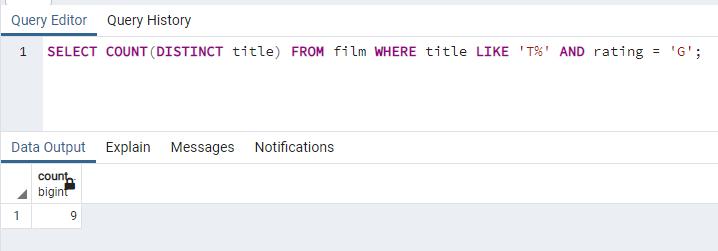

# Kodluyoruz Back-End Java Eğitimi 061

Bu repo [Kodluyoruz](https://www.kodluyoruz.org) Back-End Java Eğitiminde 
oluşturduğum projelerdendir.

---
## SQL Patikası Ödev 4

## Online Film Sistemi

Aşağıdaki sorgu senaryolarını dvdrental örnek veri tabanı üzerinden gerçekleştiriniz.

1) film tablosunda bulunan replacement_cost sütununda bulunan birbirinden farklı değerleri sıralayınız.

2) film tablosunda bulunan replacement_cost sütununda birbirinden farklı kaç tane veri vardır?

3) film tablosunda bulunan film isimlerinde (title) kaç tanesini T karakteri ile başlar ve aynı zamanda rating 'G' ye eşittir?

4) country tablosunda bulunan ülke isimlerinden (country) kaç tanesi 5 karakterden oluşmaktadır?

5) city tablosundaki şehir isimlerinin kaçtanesi 'R' veya r karakteri ile biter?

---
## License
[MIT](https://choosealicense.com/licenses/mit/)
