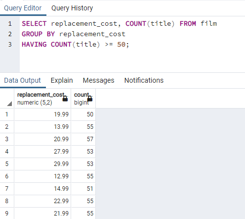

# Kodluyoruz Back-End Java Eğitimi 064

Bu repo [Kodluyoruz](https://www.kodluyoruz.org) Back-End Java Eğitiminde 
oluşturduğum projelerdendir.

---
## SQL Patikası Ödev 7

## Online Film Sistemi

Aşağıdaki sorgu senaryolarını dvdrental örnek veri tabanı üzerinden gerçekleştiriniz.

1) film tablosunda bulunan filmleri rating değerlerine göre gruplayınız.

2) film tablosunda bulunan filmleri replacement_cost sütununa göre grupladığımızda film sayısı 50 den fazla olan replacement_cost değerini ve karşılık gelen film sayısını sıralayınız.

3) customer tablosunda bulunan store_id değerlerine karşılık gelen müşteri sayılarını nelerdir?

4) city tablosunda bulunan şehir verilerini country_id sütununa göre gruplandırdıktan sonra en fazla şehir sayısı barındıra country_id bilgisini ve şehir sayısını paylaşınız.

---
## License
[MIT](https://choosealicense.com/licenses/mit/)
