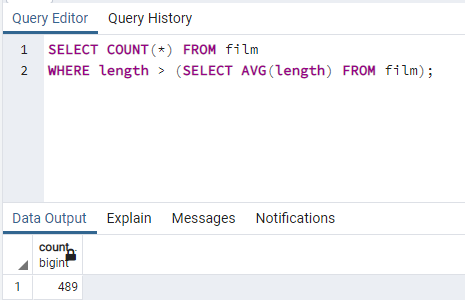
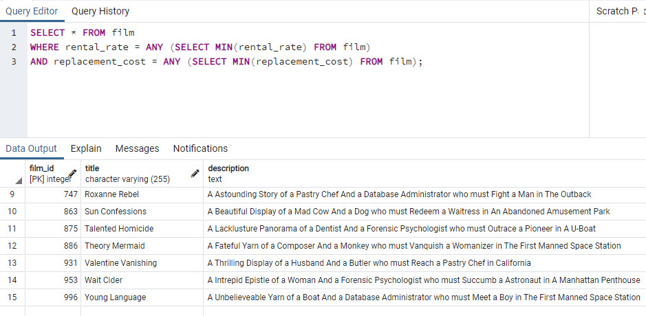

# Kodluyoruz Back-End Java Eğitimi 069

Bu repo [Kodluyoruz](https://www.kodluyoruz.org) Back-End Java Eğitiminde 
oluşturduğum projelerdendir.

---
## SQL Patikası Ödev 12

## Online Film Sistemi

1) film tablosunda film uzunluğu length sütununda gösterilmektedir. Uzunluğu ortalama film uzunluğundan fazla kaç tane film vardır?

2) film tablosunda en yüksek rental_rate değerine sahip kaç tane film vardır?

3) film tablosunda en düşük rental_rate ve en düşün replacement_cost değerlerine sahip filmleri sıralayınız.

4) payment tablosunda en fazla sayıda alışveriş yapan müşterileri(customer) sıralayınız.

---
## License
[MIT](https://choosealicense.com/licenses/mit/)
