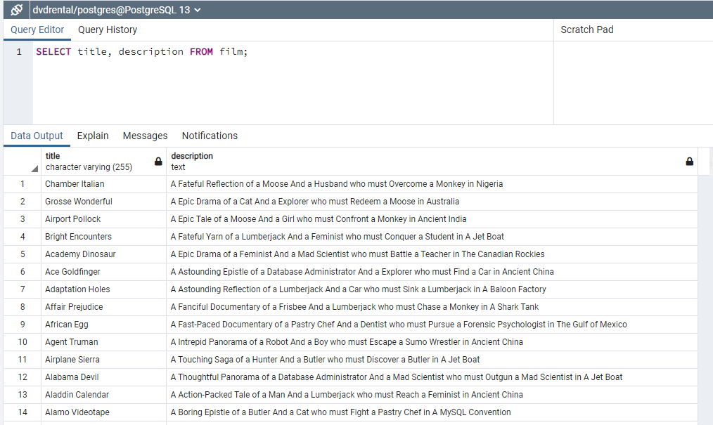
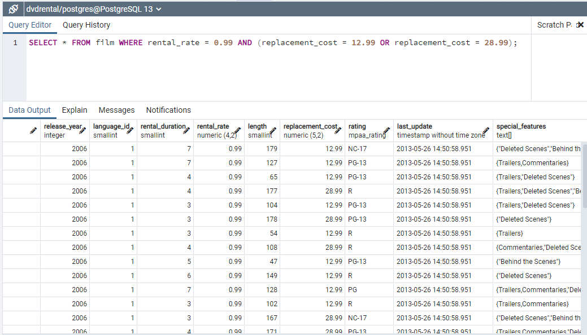
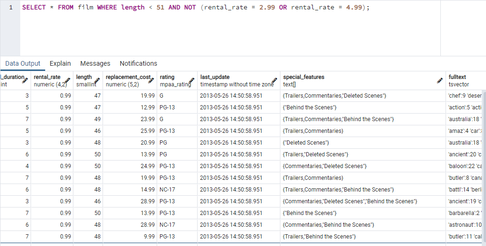

# Kodluyoruz Back-End Java Eğitimi 058

Bu repo [Kodluyoruz](https://www.kodluyoruz.org) Back-End Java Eğitiminde 
oluşturduğum projelerdendir.

---
## SQL Patikası Ödev 1

## Online Film Sistemi

Aşağıdaki sorgu senaryolarını dvdrental örnek veri tabanı üzerinden gerçekleştiriniz.

1) film tablosunda bulunan title ve description sütunlarındaki verileri sıralayınız.

2) film tablosunda bulunan tüm sütunlardaki verileri film uzunluğu (length) 60 dan büyük VE 75 ten küçük olma koşullarıyla sıralayınız.

3) film tablosunda bulunan tüm sütunlardaki verileri rental_rate 0.99 VE replacement_cost 12.99 VEYA 28.99 olma koşullarıyla sıralayınız. 

4) customer tablosunda bulunan first_name sütunundaki değeri 'Mary' olan müşterinin last_name sütunundaki değeri nedir?

5) film tablosundaki uzunluğu(length) 50 ten büyük OLMAYIP aynı zamanda rental_rate değeri 2.99 veya 4.99 OLMAYAN verileri sıralayınız.

---
## License
[MIT](https://choosealicense.com/licenses/mit/)
