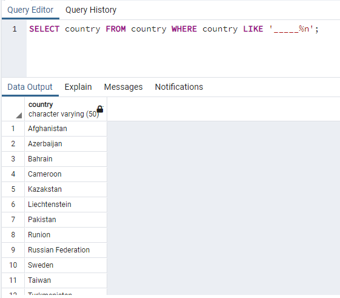
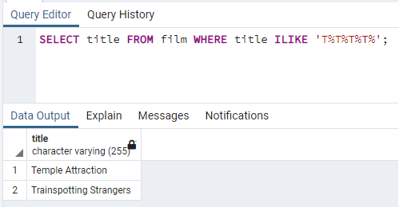
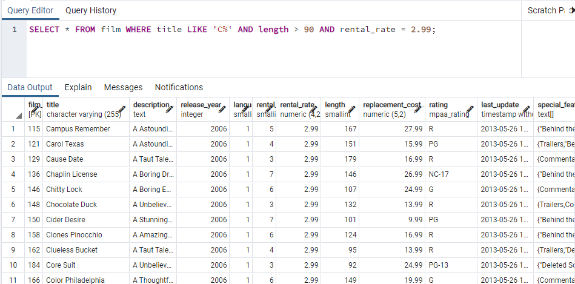

# Kodluyoruz Back-End Java Eğitimi 060

Bu repo [Kodluyoruz](https://www.kodluyoruz.org) Back-End Java Eğitiminde 
oluşturduğum projelerdendir.

---
## SQL Patikası Ödev 3

## Online Film Sistemi

Aşağıdaki sorgu senaryolarını dvdrental örnek veri tabanı üzerinden gerçekleştiriniz.

1) country tablosunda bulunan country sütunundaki ülke isimlerinden 'A' karakteri ile başlayıp 'a' karakteri ile sonlananları sıralayınız.

2) country tablosunda bulunan country sütunundaki ülke isimlerinden en az 6 karakterden oluşan ve sonu 'n' karakteri ile sonlananları sıralayınız.

3) film tablosunda bulunan title sütunundaki film isimlerinden en az 4 adet büyük ya da küçük harf farketmesizin 'T' karakteri içeren film isimlerini sıralayınız.

4) film tablosunda bulunan tüm sütunlardaki verilerden title 'C' karakteri ile başlayan ve uzunluğu (length) 90 dan büyük olan ve rental_rate 2.99 olan verileri sıralayınız.

---
## License
[MIT](https://choosealicense.com/licenses/mit/)
