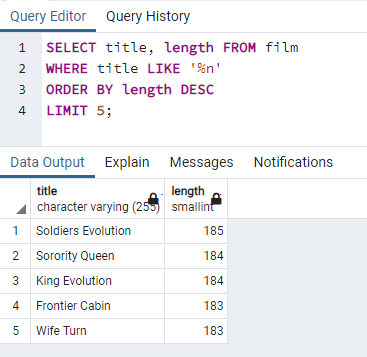
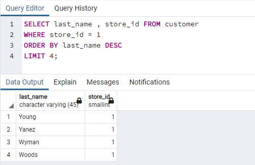

# Kodluyoruz Back-End Java Eğitimi 062

Bu repo [Kodluyoruz](https://www.kodluyoruz.org) Back-End Java Eğitiminde 
oluşturduğum projelerdendir.

---
## SQL Patikası Ödev 5

## Online Film Sistemi

Aşağıdaki sorgu senaryolarını dvdrental örnek veri tabanı üzerinden gerçekleştiriniz.

1) film tablosunda bulunan ve film ismi (title) 'n' karakteri ile biten en uzun (length) 5 filmi sıralayınız.

2) film tablosunda bulunan ve film ismi (title) 'n' karakteri ile biten en kısa (length) ikinci 5 filmi sıralayınız.

3) customer tablosunda bulunan last_name sütununa göre azalan yapılan sıralamada store_id 1 olmak koşuluyla ilk 4 veriyi sıralayınız.

---
## License
[MIT](https://choosealicense.com/licenses/mit/)
