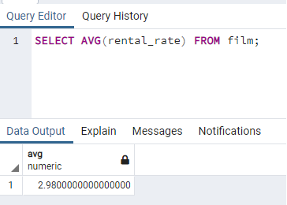
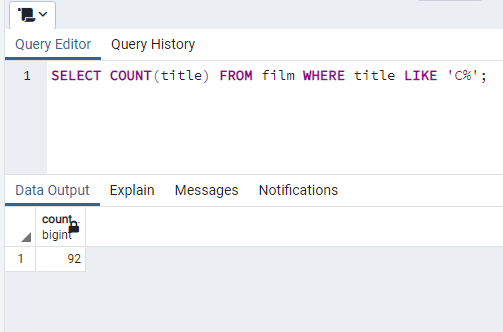
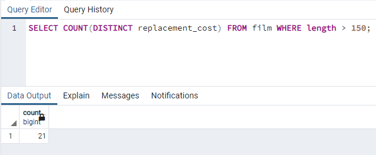

# Kodluyoruz Back-End Java Eğitimi 063

Bu repo [Kodluyoruz](https://www.kodluyoruz.org) Back-End Java Eğitiminde 
oluşturduğum projelerdendir.

---
## SQL Patikası Ödev 6

## Online Film Sistemi

Aşağıdaki sorgu senaryolarını dvdrental örnek veri tabanı üzerinden gerçekleştiriniz.

1) film tablosunda bulunan rental_rate sütunundaki değerlerin ortalaması nedir?

2) film tablosunda bulunan filmlerden kaçtanesi 'C' karekteri ile başlar?

3) film tablosunda bulunan filmlerden rental_rate değeri 0.99 a eşit olan en uzun (length) film kaç dakikadır?

4) film tablosunda bulunan filmlerin uzunluğu 150 dakikadan büyük olanlarına ait kaç farklı replacement_cost değeri vardır?

---
## License
[MIT](https://choosealicense.com/licenses/mit/)
