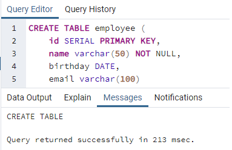
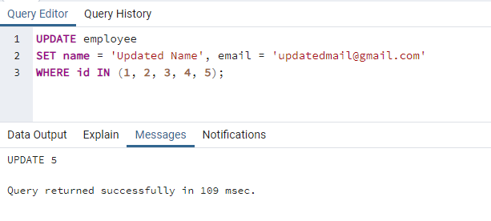

# Kodluyoruz Back-End Java Eğitimi 065

Bu repo [Kodluyoruz](https://www.kodluyoruz.org) Back-End Java Eğitiminde 
oluşturduğum projelerdendir.

---
## SQL Patikası Ödev 8

## Online Film Sistemi

1) test veritabanınızda employee isimli sütun bilgileri id(INTEGER), name VARCHAR(50), birthday DATE, email VARCHAR(100) olan bir tablo oluşturalım.

2) Oluşturduğumuz employee tablosuna 'Mockaroo' servisini kullanarak 50 adet veri ekleyelim.

3) Sütunların her birine göre diğer sütunları güncelleyecek 5 adet UPDATE işlemi yapalım.

4) Sütunların her birine göre ilgili satırı silecek 5 adet DELETE işlemi yapalım.

---
## License
[MIT](https://choosealicense.com/licenses/mit/)
