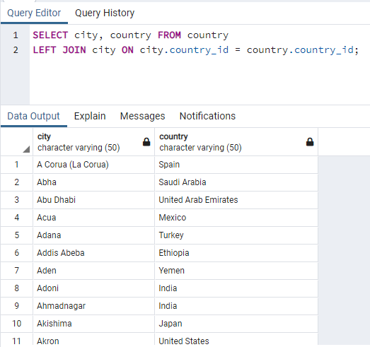
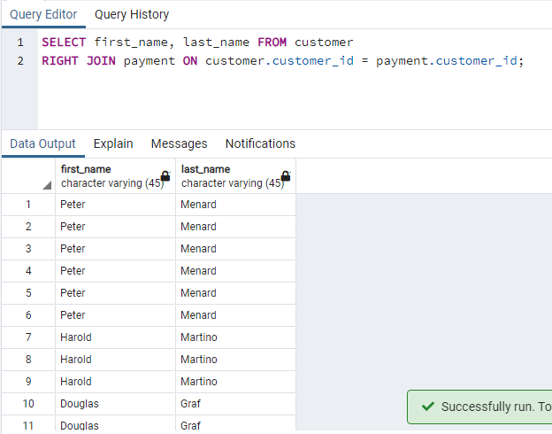

# Kodluyoruz Back-End Java Eğitimi 067

Bu repo [Kodluyoruz](https://www.kodluyoruz.org) Back-End Java Eğitiminde 
oluşturduğum projelerdendir.

---
## SQL Patikası Ödev 10

## Online Film Sistemi

1) city tablosu ile country tablosunda bulunan şehir (city) ve ülke (country) isimlerini birlikte görebileceğimiz LEFT JOIN sorgusunu yazınız.

2) customer tablosu ile payment tablosunda bulunan payment_id ile customer tablosundaki first_name ve last_name isimlerini birlikte görebileceğimiz RIGHT JOIN sorgusunu yazınız.

3) ustomer tablosu ile rental tablosunda bulunan rental_id ile customer tablosundaki first_name ve last_name isimlerini birlikte görebileceğimiz FULL JOIN sorgusunu yazınız.

---
## License
[MIT](https://choosealicense.com/licenses/mit/)
