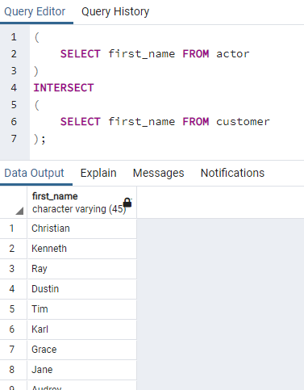

# Kodluyoruz Back-End Java Eğitimi 068

Bu repo [Kodluyoruz](https://www.kodluyoruz.org) Back-End Java Eğitiminde 
oluşturduğum projelerdendir.

---
## SQL Patikası Ödev 11

## Online Film Sistemi

1) actor ve customer tablolarında bulunan first_name sütunları için tüm verileri sıralayalım.

2) actor ve customer tablolarında bulunan first_name sütunları için kesişen verileri sıralayalım.

3) actor ve customer tablolarında bulunan first_name sütunları için ilk tabloda bulunan ancak ikinci tabloda bulunmayan verileri sıralayalım.

4) İlk 3 sorguyu tekrar eden veriler için de yapalım.

---
## License
[MIT](https://choosealicense.com/licenses/mit/)
