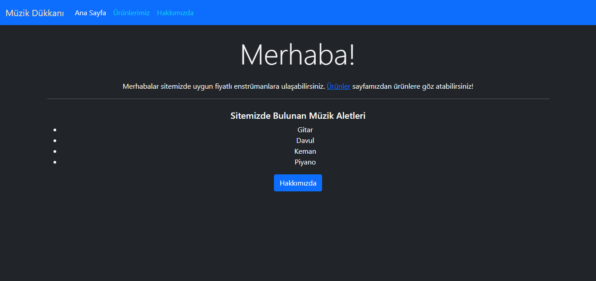
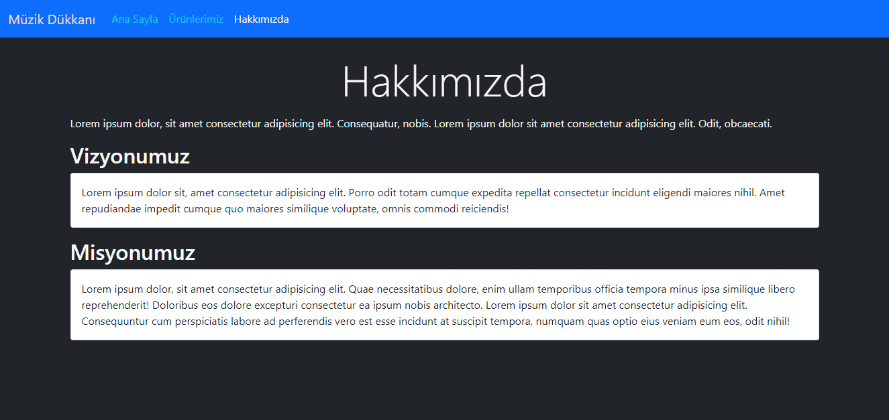
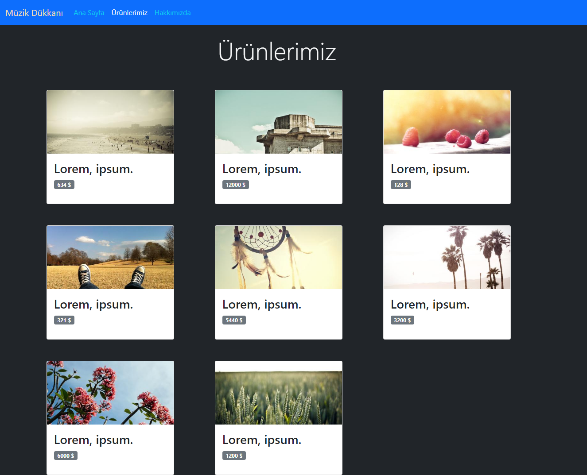

# Kodluyoruz Hi-Code Frontend Java Eğitimi 006

Bu repo [Kodluyoruz](https://www.kodluyoruz.org) Hi-Code Frontend Eğitiminde 
oluşturduğum projelerdendir.

---
## Jr-Frontend 102

## Bootstrap Özelliklerini Kullanarak Yaptığımız Siteyi Geliştirelim

### Benim düzenlediğim sayfa:
Ana Sayfa

Hakkımızda

Ürünler

Birazcık söylenenin dışına çıkıp biraz farklı bir tema yaptım.

### Ödev Konusu
Hatırlar mısınız CSS'in ilk ödevinde boynu bükük bir site yapmıştık. Bu site CSS'in özelliklerini kullanan bir müzik aleti satış sitesiydi. Bu siteyi Bootstrap ile tekrar tasarlayacağız.

### Sizden Beklediklerimiz
* HTML kısmını önceki ödevden alabilirsiniz fakat baştan yapmanızı öneririz.
* Menüyü koyu renkli olarak düzenleyin. İsterseniz arka plan rengi de verebilirsiniz.
* Ana sayfaya bir jumbotron koyup içeriğinizin açıklamasını yazınız.
* Arka plan rengini #E9ECEF ile değiştirin.
* Ürünlerimiz sayfasında card yapısını kullanın.
* Kullandığınız card yapısını grid sistemin içinde kullanın.
* Ürün card boyutlarının tamamen aynı olduğuna dikkat edin.
* Hakkımızda sayfasını da bir card yapısı içine alın.
* Bootstrap Dökümantasyonu'nu iyi inceleyip farklı elementleri denemeye çalışın.

---
## License
[MIT](https://choosealicense.com/licenses/mit/)
 