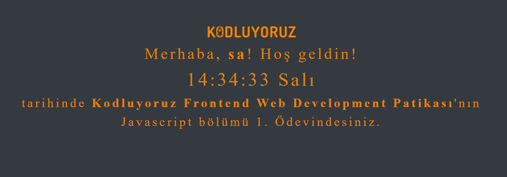

# Kodluyoruz Hi-Code Frontend Java Eğitimi 007

Bu repo [Kodluyoruz](https://www.kodluyoruz.org) Hi-Code Frontend Eğitiminde 
oluşturduğum projelerdendir.

---
## Jr-Frontend 102

## Javascript Saat ve Karşılama

### Benim düzenlediğim sayfa:

### Ödev Konusu
Basitçe sizden girişte isminizi isteyip sonra bu ismi karşılama ekranına yerleştirerek o anki saati ve günü gösteren bir ekran. Yapması oldukça kolay ve zevkli!

Burada bizim verdiğimiz ile sınırlı kalmak zorunda değilsiniz, hatta hayal gücünüzü çalıştırarak yeni şeyler üretirseniz daha mutlu oluruz!

Hepinize başarılar ve kolay gelsin.

---
## License
[MIT](https://choosealicense.com/licenses/mit/)
 